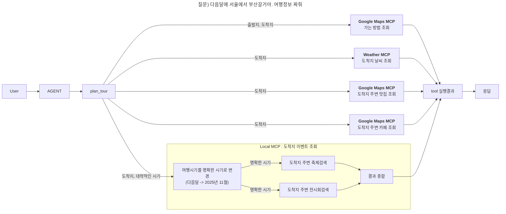

```mermaid
---
title: 질문) 다음달에 서울에서 부산갈거야. 여행정보 짜줘
---
flowchart LR
User --> AGENT -->plan_tour
plan_tour -->|출발지, 도착지| D["`**Google Maps MCP**
가는 방법 조회
`"]
plan_tour -->|도착지| W["`**Weather MCP**
도착지 날씨 조회
`"]

plan_tour -->|도착지| SR["`**Google Maps MCP**
도착지 주변 맛집 조회
`"]
plan_tour -->|도착지| SC["`**Google Maps MCP**
도착지 주변 카페 조회
`"]

plan_tour -->|도착지, 대략적인 시기| J["`여행시기를 명확한 시기로 변경
(다음달 -> 2025년 11월)`"]

subgraph Local MCP : 도착지 이벤트 조회
J -->|명확한 시기| J1["`도착지 주변 축제검색`"]
J -->|명확한 시기| J2["`도착지 주변 전시회검색`"]
J1 -->J3["결과 종합"]
J2 -->J3
end

D --> A["tool 실행결과"]
W --> A
SR --> A
SC --> A
J3 --> A
A --> 응답
```